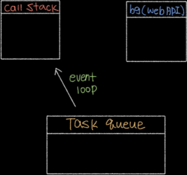

# #javascript

### 이벤트 기반
`document.getElementById('btn').addEventListener('click', ()=>{...});`

### 콜 스택과 Web Api, 태스트 큐, 이벤트 루프의 동작


* `call stack`: 함수 호출시, 그 함수기 쌓이는 장소입니다. `함수가 실행되는 환경`이라고 이걸 `컨텍스트` 라고 하는데, 그냥 함수라고 보면 됩니다.
* `backgound(Web API)`: `setTimeout`, `click`등 `Web API`들이 대기타는 장소입니다.
* `task queue`: 위의 `Web API`들 이 대기를 마치고 `call stack`에 들어가서 실행되기 전에 대기타는 장소입니다.
* `event loop`: `call stack`을 보고 비어있을 때, `task queue`에서 하나씩 가져와서 `call stack`에 넣어줍니다.

```javascript
setTimeout(()=>{
    console.log('what the');
}, 1000)
```
0. `main()`이 `call stack`으로 들어갑니다. 이 `main()`은 자바스크립트 시작하면 그냥 무조건 들어갑니다. `이니시`라고 보면 됩니다.
1. `setTimeout`함수 전체가 `call stack`으로 들어갑니다.
2. `setTimeout`이 실행되고, `call stack`에서 제거된 후, 요 `setTimeout`은 `bg`로 들어갑니다.
3. 그 다음 `main()`이 `call stack`에서 제거됩니다.
4. `setTimeout`이 몇 초 였죠? 1초간 `bg`에서 기다립니다.
5. 1초가 지났습니다. `setTimeout`에 있던 `callback`함수인 `()=>{ console.log('what the'); }`이게 `task queue`로 들어갑니다.
6. `event loop`가 `call stack`에 남는게 있는지 확인합니다.
7. 어? 아무고토 없습니다. 그럼 `task queue`에 있는 `callback`을 하나씩 `call stack`으로 푸시합니다.
8. `call stack`에 들어온 `()=>{ console.log('what the'); }`를 실행해 줍니다.
* settimeout을 click이벤트로 바꿔도 같은 양상을 보입니다.


