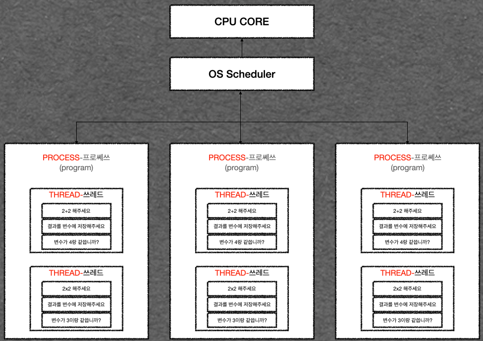

### 프로세스와 스레드
`프로세스`: 작업의 단위입니다. 프로그램이라 보면 되겠네요. 인터넷, phpstorm등..
`스레드`: `프로세스` 내에서 실행되는 흐름의 단위입니다. 스레드간은 자원을 공유하고, 프로세스간에는 공유가 안됩니다.

* 우리가 프로그램을 실행할 때, 우리는 `process`라는 것을 호출합니다.
* `process`는 `컴퓨터 프로램의 인스턴스` 입니다.
* `process`내부에는 여러개의 `thread`라는것이 있습니다.
* `thread`에 각 지시사항을 실행하기 위해서 `CPU`가 필요합니다.
* `thread`들은 `CPU`에 의해 주어지며, `CPU`는 각 `thread`들이 하나씩 실행되도록 합니다.
* `thread`와 함께 `scheduling`을 알아야 하는데, `scheduling`은`OS`가 어떤 `thread`가 어떤 순서로 실행될지를 결정합니다.
* `CPU`의 `core`가 많을수록 한 번에 많은 `thread`실행이 가능합니다.(하나의 `core`로 많은 `thread`를 실행하는 `multi threading`가 있긴합니다.)

> Thread #1
> 1. Read something from HDD
     > 1.5 I/O 처리시간
> 2. Do something from "1"

> Thread #2
> 1. Add 1+1

1. `Thread #1`의 `I/O phase에서`(1.Read file from HD) HD로부터 파일을 읽을 때, CPU는 이 읽는게 끝날때 까지 기다립니다. 
그 동안 `Thread #1`은 아무고토 안하게 됩니다.
2. 이 때, `OS scheduler`는 이 걸 감지합니다. 그리고 `Thread #1`이 멈춰 있는 동안 `Thread #2`를 실행합니다.
3. `Thread #2`가 일을 끝내면 다시 `Thread #1`으로 돌아와 일을 합니다.