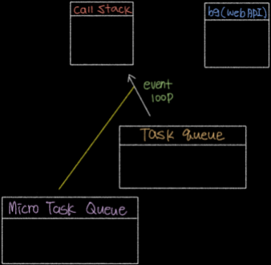

### 논블로킹 방식
오래 걸리는 작업을 background로 보내서 들 걸리는 것을 미리 실행하고, 후에 오래 걸렷던 함수를 태스크 큐로 보내서 다시 콜 스택으로 부르는 방식입니다.

### nodejs로 사용하면 안 좋은 것들 
CPU연산을 많이 요구하면, 블로킹이 발생해 스레스하나가 감당하기 어렵다고 합니다.

### 마이크로 태스크 큐
* 다른 콜백보다 우선시되는 큐 입니다.

* 아래 보라색으로 `Micro Task Queue`가 생겼습니다.
1. `Promise`에서 `resolve`된 콜백들
2. `process.nextTick(()=>{ ... })`의 `콜백`들
   이 들어있는데, `Task Queue`작업들 보다 먼저 실행이 됩니다. 그래서 노란색줄이 막 새치기 하는거처럼 표현해 보았습니다.